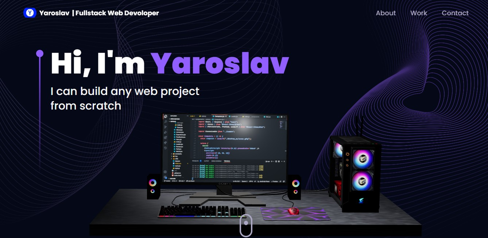

# My Personal Website Portfolio

This is my personal website portfolio built using React and Vite.

The link to website - [link](https://my-portfolio432.vercel.app/)

## Installation

1. Clone this repository
2. Run `npm install`
3. Run `npm run dev`

## Usage

To use this website, simply navigate to [http://localhost:3000](http://localhost:3000) in your web browser.

## Contributing

If you would like to contribute to this project, please fork this repository and submit a pull request.

## License

This project is licensed under the MIT License.

## Contact Information

You can contact me at [aroslavdmitriev80@gmail.com](mailto:aroslavdmitriev80@gmail.com).
