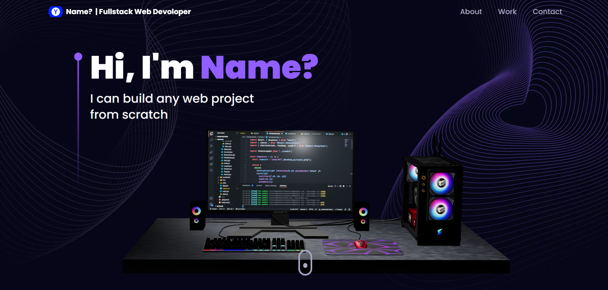

# My Personal Website Portfolio 💻

<div align="center">

[](https://my-portfolio432.vercel.app/)

[](https://github.com/ElonMusk2002/my-portfolio/stargazers)

[](https://github.com/ElonMusk2002/my-portfolio/network/members)

[](https://github.com/ElonMusk2002/my-portfolio/issues)

This is my personal portfolio website built using React, Vite, Three.js and other cool libraries!

👉  **[View Live Site](https://my-portfolio432.vercel.app/)**  👈




## 🚀 Key Features

- 🖌️ Animated 3D header using Three.js
- ✨ Clean and responsive UI 
- 📈 Skills section with proficiency bars
- 📅 Timeline of work experience
- 💻 Featured projects section
- 📬 Contact form with validation
- And more!

## 🛠 Built With

### Tech Stack


### Key Dependencies

|||||
|-|-|-|-|
|React|Vite|Three.js|Tailwind CSS|


## ⚙️ Installation

<div align="center">

### Let's get you set up!

1. Clone this repository
   ```
   git clone https://github.com/ELonMusk2002/my-portfolio.git
   ```
2. Install the required dependencies using NPM
   ```
   npm install
   ```
3. Start the development server
   ```
   npm run dev
   ```
</div>

   <div align="center">
🎉 All set, you're ready to go!
</div>

### 🤳 Usage

To view the website locally, open your web browser and navigate to http://localhost:3000

## 🔑 License

This project is open source and available under the [MIT License](LICENSE).

<p align="center">
  
</p>
